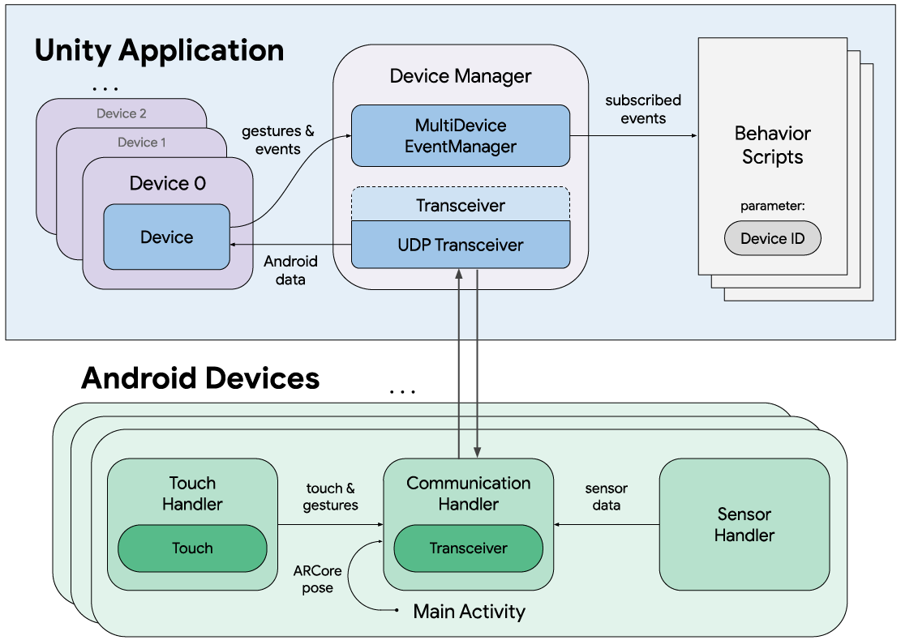

# XDTK: Cross-device Toolkit for Android & Unity

The Cross-device Toolkit (XDTK) is an open-source toolkit developed to enable simple, straight-forward communication between Android devices and the Unity game engine. The toolkit is comprised of a native Android application (one for Phone/Tablet devices, and one for WearOS devices) and a Unity package. XDTK handles device discovery and communication over WiFi, with Android devices providing a steady stream of sensor data, input events, and (if applicable) ARCore pose information by default.


## Reference

This toolkit was published at the 3rd Annual [Workshop on Open Access Tools and Libraries for Virtual Reality](https://openvrlab.github.io/) at IEEE VR 2024.

```bibtex
@inproceedings{GonzalezXDTK2024,
    author    = {Eric J. Gonzalez, Khushman Patel, Karan Ahuja, and Mar Gonzalez-Franco},
    title     = {XDTK: A Cross-Device Toolkit for Input & Interaction in XR},
    booktitle = {Proceedings of the IEEE VR Conference 2024},
    year      = {2024},
    address   = {Orlando, Florida},
    url       = {https://github.com/google/xdtk}
}
```

## Installation

### 1. Clone or download this repository

``` shell
git clone https://github.com/google/xdtk
```

### 2. Compile Android application to your device(s)
Use [AndroidStudio](https://developer.android.com/studio) to open and build the XR Input app to your device. 

For Phone and Tablet devices, use:
``` 
xdtk/android/XRInput
```

For WearOS devices (e.g., smartwatch), use:
``` 
xdtk/android/XRInputWearOS
```

Alternatively, you can directly install the appropriate APK from [here](android/apks).

[Screenshots of Phone & Watch Apps]

### 3. Install XDTK Unity package

In your Unity project:

* Go to **Window** → **Package Manager**

* Click the **[+]** button in the status bar and select **Add package from disk**

* Navigate to the XDTK directory and select the **package.json** file at `xdtk/unity-package/package.json `

Alternatively, you can [install directly from git](https://docs.unity3d.com/Manual/upm-ui-giturl.html) by selecting **Add package from git URL** and using following link: `https://github.com/google/xdtk.git?path=unity-package`

### 4. Network setup
Connect all devices to the same **IPv4 wireless network** (e.g., a mobile hotspot). This includes all Android devices and the device running your Unity application (e.g., your laptop, desktop, or XR headset).

### 5. Test connection
* From the XDTK package directory in Unity, open the **XDTK-Sample** scene, located in `Runtime/Scenes`. **Run this scene** using the Play button, or build and run it on your device.

* On your Android device(s), open the **XR Input** app and press **Edit** to enter the IPv4 address of the device running Unity. (Here is how to locate this on [Windows](https://support.microsoft.com/en-us/windows/find-your-ip-address-in-windows-f21a9bbc-c582-55cd-35e0-73431160a1b9), [Mac](https://www.security.org/vpn/find-mac-ip-address/), and [Meta Quest](https://multitechverse.com/how-to-check-oculus-quest-2-ip-address/)). *Note: this value is stored between app sessions.*

* Tap **Start Connection** to begin sending data to Unity. If the connection is successful, the status indicator in the Android app will be green. In Unity, a **Device** GameObject will appear and should rotate as you rotate your Android device. As you connect more devices they should also appear here. 

* If the connection is unsuccessful (or if the Unity side is not running), the Android status indicator will be orange and read *"Sending..."*.

* To disconnect, quickly tap anywhere on the screen 8 times.


### Troubleshooting
Make sure the Android and Unity platforms are connected to the same IPv4 network, the IP address of the Unity platform is entered correctly, and both the Unity and Android applications are running. 

If the device is *still* not connecting, your firewall may blocking Unity from establishing a connection. Check your [firewall settings](https://ozekisms.com/p_2615-how-to-allow-incoming-connections-in-windows-firewall.html) and make sure inbound and outbound communication is allowed for Unity.

## System Architecture



## Using XDTK
* For details on creating XDTK-based Unity applications, see [here](unity-package/README.md).
* For details on the Android application and communication protocol, see [here](android/README.md).

## Contributors

 - **Eric J. Gonzalez**, Google AR
 - **Khushman Patel**, Google AR
 - **Karan Ahuja**, Northwestern University & Google AR
 - **Mar Gonzalez-Franco**, Google AR


