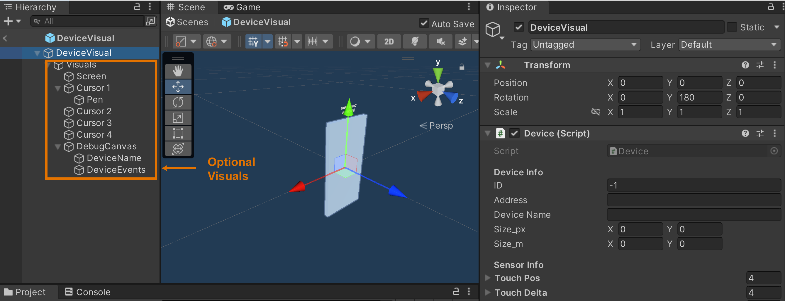
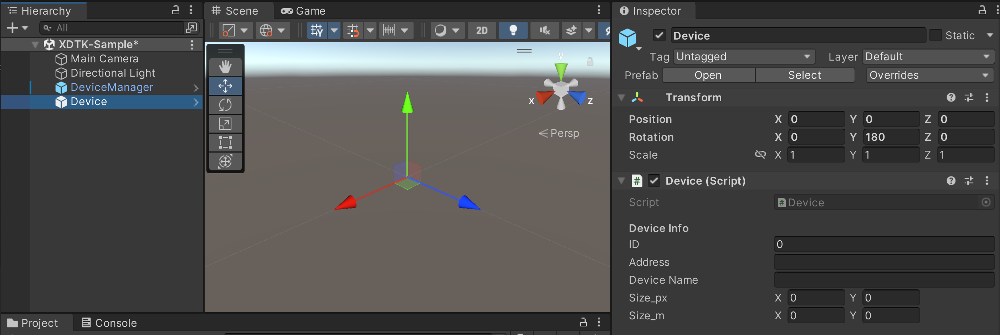
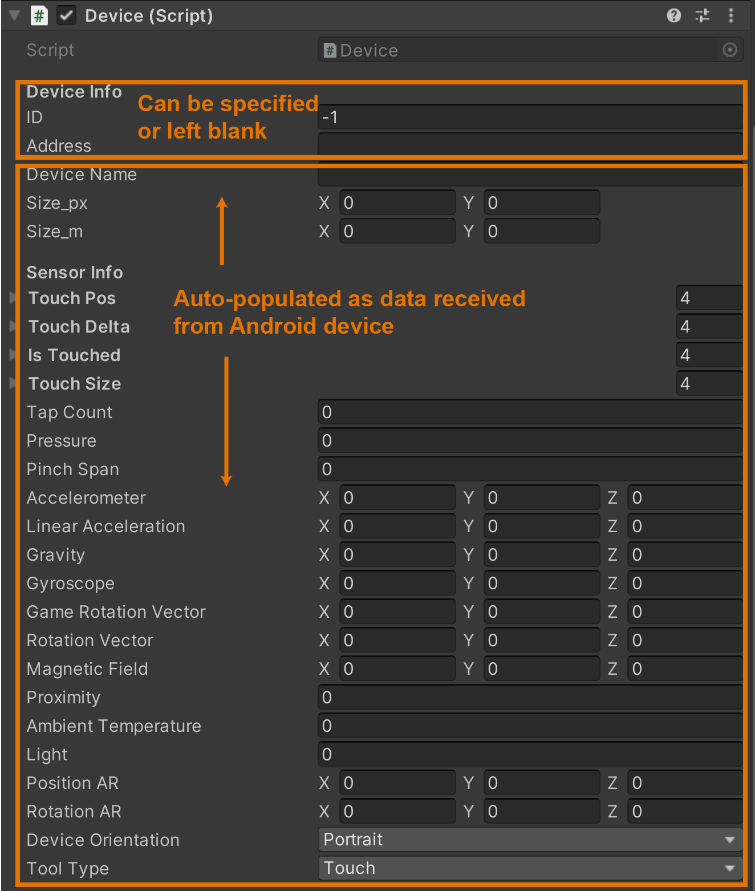

# XDTK: Unity Package


## What's Included?
The Unity package includes two prefabs that enable the XDTK framework:

1. **DeviceManager:** This GameObject handles communication and events. This is the only prefab you need to include in your scene to get the core functionality working. It includes the following scripts:

    * *UDPTransceiver.cs:* This script implements communication and routes messages to the different **Device** GameObjects. When a message is received from a new Android device, this script instantiates a new **Device** GameObject and assigns it a numerical ID.

    * *MultiDeviceEventManager.cs:* This script contains a framework of custom events based on Android touch gestures.

2. **Device:** This GameObject is the Unity representation of a given Android device. It has one attached script (*Device.cs*), which contains the device's information, sensor readings, and ID. 

    * *Device* parses messages received by *UDPTransceiver*, stores the relevant device and sensor data, and fires interaction events.

    * Other scripts reference this (along with *MultiDeviceEventManager*) when they want to use inputs from this device to drive a given behavior.

To aid in debugging, we also provide a **DeviceVisual** prefab, which creates a simple visualization of the connected device. By default this visualization:
* displays the device name and IP address
* resizes to the reported device's screen size
* follows the connected device's orientation (via gyroscope)
* displays multi-touch points and touch gesture events (tap, double tap, fling, pinch)
* displays a virtual stylus when a pen is used on the device (when applicable)



## Creating Behaviors
The only thing a behavior script needs to specify is the ID number of the device it wants to "listen" to. 

* *Note: A **Device**'s ID can be any positive number, but by default it's assigned as the order in which the device connected to Unity. (The first device to connect is assigned 0, the second 1, and so on. This behavior can be overwritten, as described [here](#connecting-devices))*.

The general procedure for creating a new behavior is:

1. Set up listeners for any desired [events](unity-package/Runtime/Scripts/Core/MultiDeviceEventManager.cs)
2. Get references to *MultiDeviceEventManager* and specified *Device*
3. In `Update()`, update relevant behavior variables based on *Device* sensor readings.
4. In event listeners, check if this event came from the target ID and, if so, respond.

### Example Behavior: Scale on Pinch
This example script changes the scale of the GameObject it is attached to based on a pinch gesture performed on Device 0. 
``` C
using System.Collections;
using System.Collections.Generic;
using UnityEngine;


public class ScaleOnPinch : MonoBehaviour
{
    public int deviceToListenTo = 0;
    MultiDeviceEventManager eventManager;
    bool pinching = false;
    Device device;
    float startSpan;
    Vector3 startScale;


    private void OnEnable() {
        eventManager.OnPinchStart.AddListener(OnPinchStart);
        eventManager.OnPinchEnd.AddListener(OnPinchEnd);
    }


    private void OnDisable() {
        eventManager.OnPinchStart.RemoveListener(OnPinchStart);
        eventManager.OnPinchEnd.RemoveListener(OnPinchEnd);
    }


    void Awake() {
        // initialize event manager
        eventManager = FindObjectOfType<MultiDeviceEventManager>();
    }


    void Update() {
        UpdateTargetDevice();

        // read Device sensor values, if relevant
        // ...

        // set scale based on device.PinchSpan
        if (pinching && device != null) {
            var scaleFactor = (device.PinchSpan / startSpan);
            gameObject.transform.localScale = scaleFactor * startScale;
        }
    }


    private void UpdateTargetDevice() {
        // find target device
        foreach (Device d in FindObjectsOfType<Device>()) {
            if (d.ID == deviceToListenTo) {
                device = d;
                break;
            }
        }
    }

    /* Event listeners */
    private void OnPinchStart(int ID, float span) {
        if (deviceToListenTo == ID) {
            pinching = true;
            startSpan = device.PinchSpan;
            startScale = gameObject.transform.localScale;
        }
    }


    private void OnPinchEnd(int ID, float span) {
        if (deviceToListenTo == ID) {
            pinching = false;
        }
    }
}

```

## Connecting Devices
In some cases, you may not want Unity to auto-assign the ID of a device based on connection order. For example, you may want a particular Android device to always have the same ID. You can specify this by directly including a **Device** Prefab in your scene, and specifying its ID and/or IP address.
* When receiving a message from a new Android device (i.e., from an unseen IP address), *UDPTransceiver* will first check if any unassigned **Device** GameObjects have this IP specified. If so, messages received from that IP are routed to that **Device**.




## Samples
From the package manager, you can import `XDTK Samples` which include a number of example scenes:
* Controlling an object using ARCore pose and orientation of a device
* Dragging to move an object along the horizontal plane
* Dragging to move an object along the plane of the device (e.g. uses gyroscope orientation)
* Pinching to scale an object and dragging to rotate
* Using two devices to control the rotation of two objects

